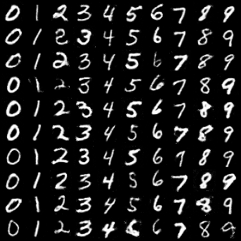
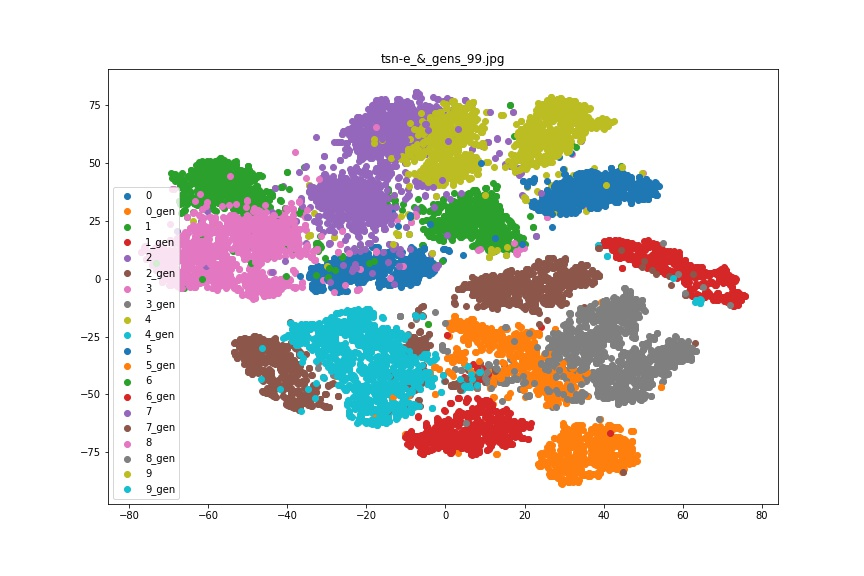
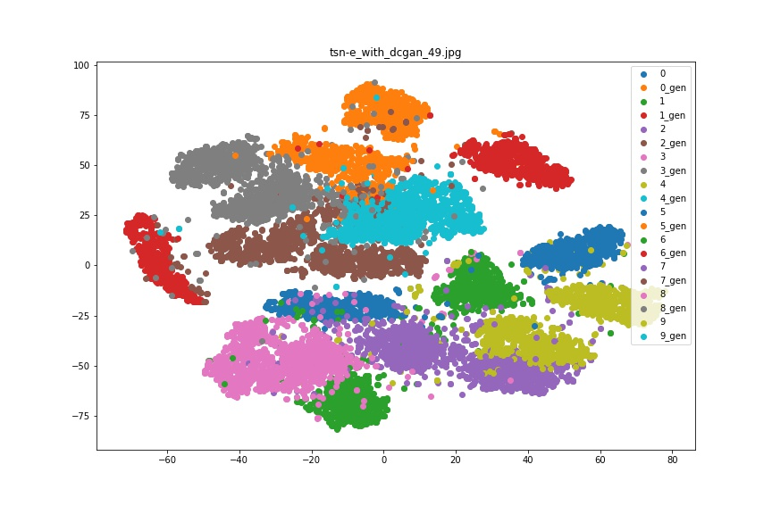

# Data Augmentation by GAN

I test whether GANs are of great use in data augmentation.
データ拡張をGANでできないか検証する．　

### Data
1. mini mnist data to classify images
https://www.ohmsha.co.jp/book/9784274502484/

2. dafault mnist to train GAN, and down sample for classification

```
--- data
    --- train
        --- class0
        --- class1
            :
            :
        --- class9
    --- test
        --- class0
        --- class1
            :
            :
        --- class9
```

### Proposal

Baseline: ２層のCNNと2層のFCNでの識別を実行する．プーリング層はMaxプーリング, 活性化関数はReLUを用いた．optimizerはAdam(ハイパーパラメータは文献値)である． 

Extension1: モデルの頑健性を高めるため，ランダムに[-t,t]度の回転を入力に加えた(t=5,10,15)． Random roation from angle -t to t(t=5,10,15).

blend = (augmented data size)/(total data size)

Extension2: cGANとDCGANで生成した手書き文字を生成し，データを増やし精度を比較した．  Generate new data by cGAN, DCGAN.

cGANは入力にラベルを条件づけて生成する．(200epochs training)   
また，DCGANはそのような条件づけができないので，10個のGANを学習しそれぞれのデータを生成した．(50 epochs training)



### Experiment, Result
全体で5回試行し，各10epoch学習した．この平均値とその95%信頼区間を報告する．($\bar{X} \pm 1.96*SE$)
I sampled 5 times each experiment, which trains 10 epochs.

| model | loss| acc|
|:---:|:---:|:---:|
|baseline CNN |0.175 | 95.840|
|baseline+rotation(theta=5) |0.171|95.820|
|baseline+rotation(theta=10) |0.152|**96.070**|
|baseline+rotation(theta=15) |0.140|96.030|
|baseline+cGAN(blend=0.5) |0.195 |95.260 |
|baseline+cGAN(blend=0.333) | 0.247 |95.600|
|baseline+DCGAN(blend=0.5)|0.193|95.140|
|baseline+DCGAN(blend=0.333) | 0.216|95.860|


### Discussion

GANのデータ拡張について，How good is my GAN?(Konstantin Shmelkov, Cordelia Schmid, Karteek Alahari) (https://arxiv.org/abs/1807.09499) 中で，GANの生成はクラスの中間データも生成してしまう可能性があるので，有効なデータ拡張になり得ないとある．また，CNN自体は人間の知覚と違う特徴に注目しているため，人間の目にはそっくりな手書き文字も，異なって見える．下のt-SNEでプロットした図を見れば，NNにとって，生成した文字が本物の文字の識別は容易であるとわかる．むしろ，ランダムに回転させる方が，回転不変量を獲得でき，モデルが汎化した．

In terms of data augmentation by GAN, according to How good is my GAN?(Konstantin Shmelkov, Cordelia Schmid, Karteek Alahari) (https://arxiv.org/abs/1807.09499) , there is a risk to generate intermidiate data between class clusters. Thus, it is not a effective tool to augment data. Also, CNN itself focuses on different fetures from us, so if it looks like realistic hand letters, it differs in neural net's eyes as you can see figures below.　Rather, it is a better strategy to rotate randomly to obtain rotation-invarient features.


**Data Distribution of cGAN**


**Data Distribution of DCGAN**
