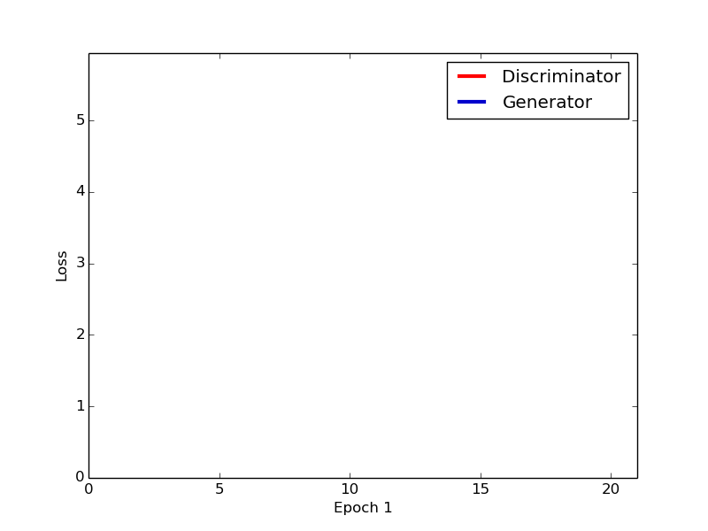
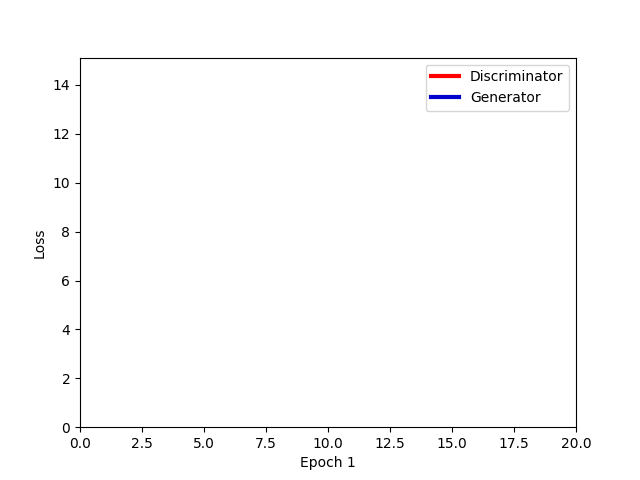

# DCGAN
PyTorch implementation of [Deep Convolutional Generative Adversarial Networks](http://arxiv.org/abs/1511.06434) (DCGAN), which is a stabilize Generative Adversarial Networks. The origin code can be found [here](https://github.com/soumith/dcgan.torch).

## Network architecture

* Generator
	* input: a vector with z_size.
	* hidden layers: Four 4x4 transposed convolutional layers (1024, 512, 256, and 128 kernels, respectively) with ReLU
	* output layer: 4x4 transposed convolutional layer (channel_size kernels, 4096 nodes = 64x64 size image) with Tanh.
	* BatchNormalization is used except for output layer.

* Discriminator
	* input: a vector with channel_size * image_size * image_size.
	* hidden layers: Four 4x4 convolutional layers (128, 256, 512, and 1024 kernels, respectively) with LeakyReLU (negative slope is 0.2).
	* output layer: 4x4 convolutional layer (1 node) with Sigmoid.
	* BatchNormalization is used except for 1st hidden layer and output layer.

All of the transposed convolutional layer and convolutional layer are initilized by a normal distribution with 0.0 mean and 0.02 std.

## MNIST dataset
* For MNIST image, the channel_size is 1 and image_size is 64.
### Results
* The learning rate is 0.0002, batch size is 128 and the optimizer is Adam.

<table align='center'>
<tr align='center'>
<td> Gnerated Images </td>
<td> DCGAN Loss </td>
</tr>
<tr>
<td>
<td>
</tr>
</table>

## CelebA dataset
* For CelebA images, the channel_size is 3 and image_size is 180 x 180, which has been aligned and cropped. And then, it will be resized to 64 x 64.
### Results
* The learning rate is 0.0002, batch size is 128 and the optimizer is Adam.

<table align='center'>
<tr align='center'>
<td> Gnerated Images </td>
<td> DCGAN Loss </td>
</tr>
<tr>
<td>
<td>
</tr>
</table>

## LSUN dataset
* For LSUN images, the channel_size is 3. And then, it will be resized to 64 x 64.
### Results
* The learning rate is 0.0002, batch size is 1024 and the optimizer is Adam.

<table align='center'>
<tr align='center'>
<td> Gnerated Images </td>
<td> DCGAN Loss </td>
</tr>
<tr>
<td>
<td>
</tr>
</table>

## WikiArt dataset
* For WikiArt images of Impressionism, the channel_size is 3. And then, it will be resized to 64 x 64.
### Results
* The learning rate is 0.0002, batch size is 128 and the optimizer is Adam.

<table align='center'>
<tr align='center'>
<td> Gnerated Images </td>
<td> DCGAN Loss </td>
</tr>
<tr>
<td>
<td>
</tr>
</table>

### How to run in Google Colaboratory
1. Select GPU.

Edit -> Notebook settings -> GPU

2. Mount your Google Drive
~~~python
#to access your google drive folder
from google.colab import auth, drive, files, output
drive.mount('/content/drive')
~~~

3. Import the folder from github & setup
~~~python
!git clone https://github.com/takehiko-ohkawa/GANs.git
import os
os.chdir("./GANs/DCGAN")
!pwd
!pip install -r requirements.txt
~~~

4. Train 

overwrite train.sh, config.yml before training

~~~python
%%writefile train.sh
mkdir log
mkdir log/progress
export PYTHONUNBUFFERED="True"
LOG="log/progress/train-`date +'%Y-%m-%d-%H-%M-%S'`.log"
python train.py \
--name DCGAN_test \
--train_dir /content/drive/My\ Drive/data \
--save_colab_dir /content/drive/My\ Drive/DCGAN \
--config config.yml > $LOG \
--load_model False \
--restart 0
~~~

~~~python
%%writefile config.yml
workers: 6
display: 100
epoches: 70
batch_size: 128
base_lr: 0.0002
beta1: 0.5

dataset: 'wikiart'
image_size: 64
z_size: 100
channel_size: 3
ngf: 128
ndf: 128
~~~

train

~~~python
! chmod ugo+x ./train.sh
! ./train.sh
~~~

- make a folder or copy a folder
~~~python
#make
!mkdir <folder>
#copy
!cp -r <folderA> <folderB> #copy A->B
~~~

- Overwrite your code

~~~python
%%writefile oo.py
<contents of oo.py file>
~~~

- Check GPU status

~~~python
!df -h #desk status
!free -h #memory status
!ps aux #process status
!nvidia-smi #GPU status
!cat /proc/uptime |awk '{print $1/86400"days"}' #remaining time - upto 0.5days
~~~

- Download files

~~~python
files.download(<file>)
~~~

## References
1. https://github.com/soumith/dcgan.torch
2. https://github.com/znxlwm/pytorch-MNIST-CelebA-GAN-DCGAN
3. https://github.com/togheppi/DCGAN
4. https://github.com/carpedm20/DCGAN-tensorflow
5. https://github.com/last-one/DCGAN-Pytorch

